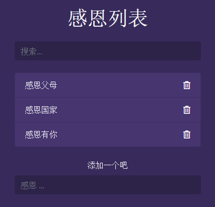

# To-do-list (感恩APP)

项目灵感来源于待办事项清单类型应用，可以其添加和删除待办事项，应用方法与操作与Todo app没有区别，可以添加和删除。只不过把待办清单变成了感恩清单。 (例如我感恩/我的朋友/家人的健康...)

### About

The objective of this project was to create a simple to do app, but intead of adding and removing to-do items, add things we are greatful for. e.g. (Im greatful for my health/my friends/my family...)
### Aim
<ul>
  <li>Captures user input and display them on the DOM  </li>
  <li> Add Create/Remove functions</li>
  
</ul>

### Tools used
<ul>
  <li>Html</li>
  <li>CSS</li>
  <li>Javascript</li>
</ul>

### How to run
To run this project simply go to my Github repository and download all the files, click on index.html to get started!

### Project URL
This project is currently hosted at: https://snaxbox.github.io/to-do-list/